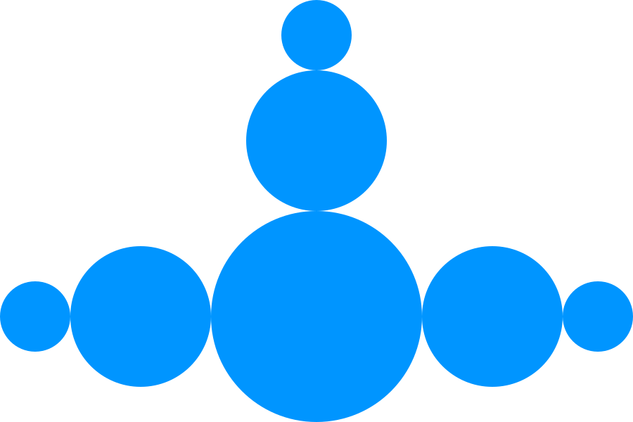

    
    <h1>Sapere</h1>
    
<strong>Project hub and tracker</strong>

    
<a href='https://sapere.bobman.dev'>website</a>

---

## Introduction

Sapere (_sa-pay-ree_) is a completely free and open source software. It is
created with insperation from [plane.so](https://plane.so). It does not have nearly
the amount of features or consistent activity, it is more of a 'passion project'.

## Files

In [files.ts](src/lib/server/files.ts), there is an adapter for managing file
storage. I have used minio as that is how I host it but you can easily change
this using [files-sdk](https://files-sdk.dev/).

## Analytics

Current in [analytics.svelte](src/routes/analytics.svelte), there is a setup
that is specific to me. If you fork or use this project it is required that you
remove this out and if you choose to, add your own analytics.
